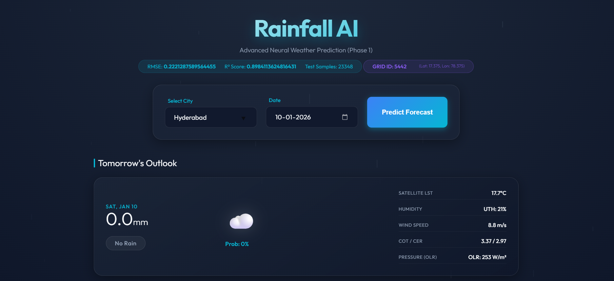

# Rainfall Prediction Model (AI-Based) 🌦️

This project implements an advanced AI-based rainfall prediction system using **INSAT-3DR satellite data** and **Machine Learning**. It predicts daily rainfall amounts (in mm) for locations across India for the next 7 days.



## 🚀 Features

*   **Satellite-Driven**: Uses realistic satellite parameters including:
    *   **HEM** (Hydro-Estimator Rainfall)
    *   **OLR** (Outgoing Longwave Radiation)
    *   **UTH** (Upper Tropospheric Humidity)
    *   **LST** (Land Surface Temperature / Cloud Top Temp)
    *   **WDP** (Wind Derived Products - Speed)
    *   **COT** (Cloud Optical Thickness) & **CER** (Cloud Effective Radius)
*   **Temporal Features**:
    *   **Cyclic Time**: Day of Year (Sine/Cosine), Week of Year (Sine/Cosine).
    *   **Lag Features**: Historic rainfall data (3-day and 7-day lags).
*   **Advanced Regression**: Predicts exact rainfall quantity using a **HistGradientBoostingRegressor** with Log-Transformation.
*   **Interactive UI**: Modern, glassmorphism-based interface with dynamic weather animations.
*   **Geolocation**: 0.25° grid system for precise local weather data.

For detailed explanations of these parameters and the physics behind them, please refer to:
*   [**Feature Documentation**](Rainfall_Prediction_Features.md)
*   [**Physics & Meteorology Background**](physics.md)

## 🛠️ Setup & Installation

1.  **Clone the repository**.
2.  **Install Dependencies**:
    ```bash
    pip install -r requirements.txt
    ```

## 🏃‍♂️ How to Run

### 1. Train the Model
Train the HistGradientBoosting Regressor on the processed dataset.
```bash
python model.py
```
*This saves the trained model and metrics to `models/model_frame_1.pkl`.*

### 2. Start the Application
Launch the Flask web server.
```bash
python app.py
```
*Access the app at `http://127.0.0.1:5000`*

## 📂 Project Structure

*   `app.py`: Main Flask application.
*   `model.py`: Model training script.
*   `Rainfall_Prediction_Features.md`: Detailed feature documentation.
*   `physics.md`: Scientific background of the model parameters.
*   `changes.md`: Recent project changes and updates.
*   `requirements.txt`: Python dependencies.
*   `templates/`: Frontend HTML templates.
*   `data_processed/`: Processed parquet datasets and grid definitions.
*   `models/`: Trained model binaries.

## 📊 Model Performance
*   **R² Score**: ~0.93
*   **RMSE**: ~6.90 mm

---
*Developed for Rainfall Prediction Project - 6th Sem*
