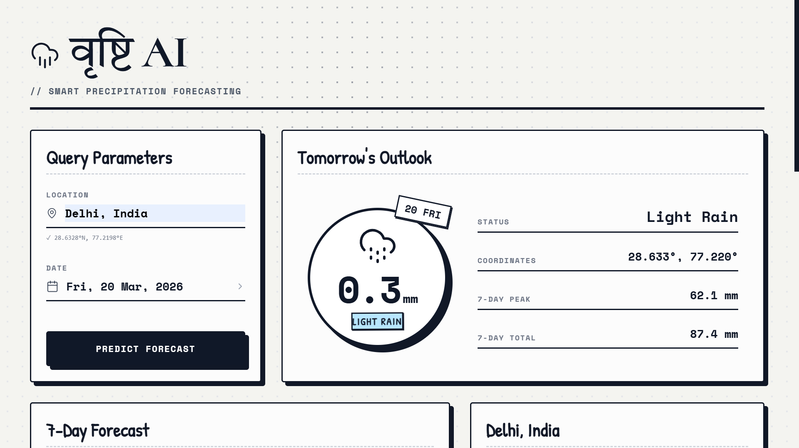

<div align="center">
<!-- Banner Wave -->


<br/>

<!-- Badges -->


<br/>

<!-- Animated Stats Row -->


</div>

---

<div align="center">
<i>An honest, physics-grounded AI system for 7-day rainfall forecasting — powered by <b>INSAT-3DR satellite data</b>, a <b>FastAPI</b> backend, and a <b>scikit-learn</b> ML pipeline.</i>
</div>

<br/>



---

## ✨ What Makes This Different

Most rainfall models are "black boxes" — they look accurate on training data but fail in production. This project is built on two core principles:

### 🔍 Honest Evaluation
- **No data leakage**: 5-Fold Time-Series Cross-Validation ensures the model is always tested on truly unseen future data.
- **Missing-data resilient**: Uses `HistGradientBoostingRegressor`, which natively handles broken or incomplete sensor readings — so no data is thrown away.

### ⚛️ Realistic Physics
- **Physics constraints**: Post-processing logic enforces meteorological rules (e.g. *clear sky → no rain*) to prevent the model from producing physically impossible predictions.
- **Uncertainty quantification**: Quantile regression predicts both the **most likely rainfall** and an **extreme-scenario estimate (95th percentile)** to account for cyclone-scale events.

---

## 🔄 Recent Improvements

- **Interactive Sketch UI & Rebranding**: Transformed the frontend into **वृष्टि AI** (formerly PLUVIO) featuring an authentic Neo-Brutalist/Sketch aesthetic. Highlights include a dynamic mouse-reactive tracking grid, animated ink-pulse severity badges, CartoDB Voyager maps with custom architectural CSS filters, and luxury typography (Cormorant & Tiro Devanagari).
- **Consistent Predictions**: Resolved issues with random feature generation by implementing a deterministic random seed based on location and date. This ensures consistent weather feature simulation across reloads without losing variance.
- **Enhanced Accuracy**: Added new meteorological interaction features (`olr_uth_interaction`, `temp_moisture`) and implemented Sample Weights to handle class imbalance (zero-inflation bias), significantly improving heavy rainfall predictions.
- **Automated Tuning**: Replaced hardcoded parameters with `RandomizedSearchCV` for optimal hyperparameter configuration during training.

---

## 📊 Model Performance

Benchmarked on ~120,000 records using a proper Time-Series Split:

| Metric | Score | Interpretation |
|--------|-------|----------------|
| **RMSE** | 5.10 mm | High precision |
| **R² Score** | 0.88 | Strong predictive power |
| **MAE** | 0.54 mm | Low average error |

---

## 📡 Satellite Features Used

The model is driven by INSAT-3DR derived satellite parameters:

| Feature | Full Name | Role |
|---------|-----------|------|
| **HEM** | Hydro-Estimator Rainfall | Primary satellite rainfall signal |
| **OLR** | Outgoing Longwave Radiation | Cloud top height proxy |
| **UTH** | Upper Tropospheric Humidity | Moisture source indicator |
| **LST** | Land Surface Temperature | Convection trigger |
| **WDP** | Wind Speed | Moisture transport |
| **COT** | Cloud Optical Thickness | Cloud microphysics |
| **CER** | Cloud Effective Radius | Cloud microphysics |

Temporal patterns are captured using **cyclic encodings** (sine/cosine of day-of-year and week-of-year) to model seasonality without overfitting to specific years.

---

## 🏗️ Project Structure

```
RainFall-Prediction-Model--IG/
│
├── src/
│   ├── app.py              # Entry-point shim — launches the backend
│   └── model.py            # Training script: feature engineering, cross-validation, model export
│
├── frontend/               # React + Vite frontend application
│   ├── src/                # React components, pages, and hooks
│   ├── package.json        # Frontend dependencies
│   ├── vite.config.ts      # Vite configuration
│   └── README.md           # Frontend-specific documentation
│
├── backend/                # FastAPI v2.0 application (modular architecture)
│   ├── app.py              # App factory (create_app, lifespan, CORS, rate-limiting, router registration)
│   ├── core/
│   │   ├── config.py       # Settings and environment variable loading
│   │   ├── dependencies.py # Singleton resources: model, scaler, grid, master dataset
│   │   └── rate_limiter.py # Shared slowapi rate-limiter instance
│   ├── routes/
│   │   ├── frontend.py     # GET /  → serves index.html
│   │   ├── health.py       # GET /api/v1/health
│   │   ├── locations.py    # GET /api/v1/locations?q=<query>
│   │   └── forecast.py     # POST /api/v1/forecast
│   ├── schemas/
│   │   ├── request_schema.py   # ForecastRequest (Pydantic v2 input model)
│   │   ├── forecast_schema.py  # ForecastResponse (Pydantic v2 output model)
│   │   └── location_schema.py  # LocationSuggestion (Pydantic v2 output model)
│   ├── services/
│   │   ├── forecast_service.py   # Orchestration layer (date → grid → model → response)
│   │   ├── model_service.py      # Feature engineering + ML inference + physics constraints
│   │   ├── geocoding_service.py  # Geoapify API wrapper with TTL cache
│   │   ├── grid_service.py       # Maps lat/lon → nearest historical grid cell
│   │   └── date_service.py       # Generates 7-day forecast date array
│   └── utils/
│       └── cache.py              # Thread-safe TTL cache implementation
│
├── templates/
│   └── index.html          # Single-page frontend application
│
├── static/                 # CSS, JavaScript, and image assets
│
├── data/                   # Raw and processed parquet datasets
│
├── models/                 # Serialised ML model and scaler artifacts (.pkl)
│
├── docs/                   # Technical documentation
│   ├── backend_architecture.md
│   ├── feature_engineering.md
│   ├── features.md
│   ├── model_architecture.md
│   ├── physics.md
│   └── research_paper.md
│
├── .env                    # Environment variables (not committed)
├── requirements.txt        # Python dependencies
└── README.md
```

---

## 🛠️ Setup & Installation

**Prerequisites:** Python 3.9+

**1. Clone the repository**
```bash
git clone https://github.com/IshanG2111/RainFall-Prediction-Model-.git
cd RainFall-Prediction-Model-
```

**2. Create a virtual environment**
```bash
python -m venv venv
venv\Scripts\activate        # Windows
# source venv/bin/activate   # Linux / macOS
```

**3. Install dependencies**
```bash
pip install -r requirements.txt
```

**4. Configure environment variables**

Create a `.env` file at the project root:
```env
GEOAPIFY_API_KEY=your_api_key_here
COUNTRY_CODE=in
DEFAULT_LIMIT=5
MIN_QUERY_LENGTH=3
```

> Get a free API key at [geoapify.com](https://www.geoapify.com/).

---

## 🚀 Running the Application

### Step 1 — Train the Model *(first time only)*

```bash
python src/model.py
```

This runs cross-validated training and saves the fitted model and scaler to `models/`.

### Step 2 — Start the Server

```bash
python src/app.py
# or directly via uvicorn (recommended):
uvicorn backend.app:app --host 0.0.0.0 --port 5000 --reload
```

| Endpoint | URL |
|----------|-----|
| **Web App** | `http://localhost:5000/` |
| **Interactive API Docs** | `http://localhost:5000/docs` |
| **OpenAPI JSON** | `http://localhost:5000/openapi.json` |

---

## 🔌 API Overview (v1)

All API endpoints are versioned under the `/api/v1` prefix. Rate limiting is enforced per IP via `slowapi`.

| Method | Endpoint | Rate Limit | Description |
|--------|----------|------------|-------------|
| `GET` | `/api/v1/health` | — | Server + model readiness check |
| `GET` | `/api/v1/locations?q=<query>` | 15/min | Location autocomplete (≥ 3 chars) |
| `POST` | `/api/v1/forecast` | 5/min | 7-day rainfall forecast for a location |

See [`docs/backend_architecture.md`](docs/backend_architecture.md) for full request/response schemas, error codes, and frontend integration patterns.

---

## 📚 Documentation

| Document | Description |
|----------|-------------|
| [`docs/frontend.md`](docs/frontend.md) | Frontend architecture, setup and UI components |
| [`docs/backend_architecture.md`](docs/backend_architecture.md) | Full API reference, layer diagram, service pipeline |
| [`docs/model_architecture.md`](docs/model_architecture.md) | ML model design and training methodology |
| [`docs/feature_engineering.md`](docs/feature_engineering.md) | Feature construction and selection rationale |
| [`docs/features.md`](docs/features.md) | Satellite feature reference |
| [`docs/physics.md`](docs/physics.md) | Physical constraints and meteorological background |
| [`docs/research_paper.md`](docs/research_paper.md) | Full research paper with methodology and results |
| [`CHANGELOG`](changes.md) | Recent changes and improvements log |

---

## 🧰 Tech Stack

<div align="center">


</div>

---

## 📄 License

This project is licensed under the MIT License - see the [LICENSE](LICENSE) file for details.

---

## 👥 Team

<div align="center">

| | Member |
|---|--------|
| 🧑‍💻 | **Ishan** |
| 🧑‍💻 | **Satya** |
| 🧑‍💻 | **Saptarshi** |
| 🧑‍💻 | **Shashwat** |
| 🧑‍💻 | **Shreyansh** |
| 🧑‍💻 | **Mayank** |

</div>

---

<div align="center">

<!-- Footer Wave -->


*6th Semester Project — Rainfall Prediction using Satellite Data & Machine Learning*

</div>
