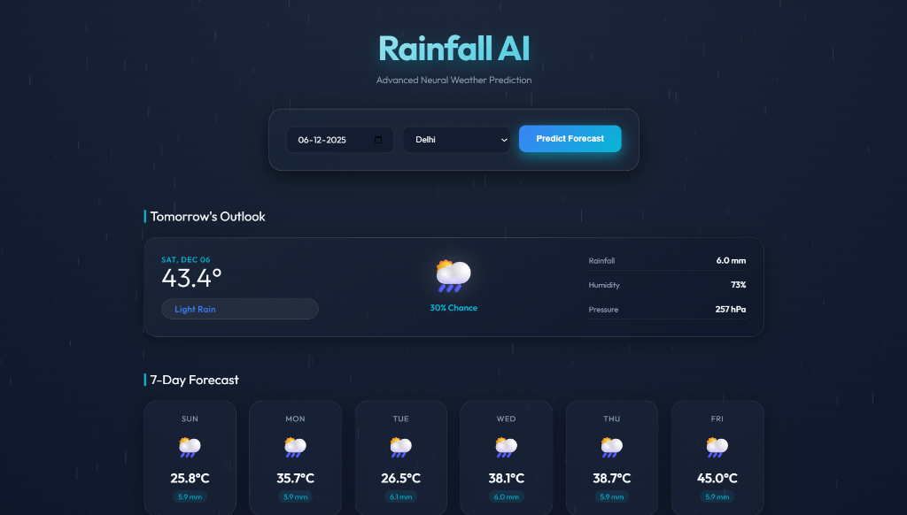

# 🌧️ Rainfall Prediction Model

An AI-powered rainfall prediction system using **Random Forest Classifier** to forecast rainfall for the next 7 days with an interactive, premium web interface.



## ✨ Features

### Core Functionality
- **Random Forest Machine Learning Model**: Predicts rainfall based on comprehensive weather features
- **Location-Based Predictions**: Supports 7 major Indian cities (Delhi, Mumbai, Bangalore, Chennai, Kolkata, Hyderabad, Pune)
- **7-Day Sequential Forecasting**: Generates predictions for the next week using actual ML model
- **Rainfall Probability**: Calculates and displays rainfall probability percentage (0-100%)
- **Real Weather Data**: Trains on 1000+ historical weather records
- **Model Persistence**: Automatically saves and loads trained model for faster predictions

### Premium UI/UX
- **Dynamic Rain Animations**: Background rain intensity changes based on the forecast (Light, Moderate, Heavy)
- **Glassmorphism Design**: Modern frosted glass effects with backdrop blur and deep dark theme
- **Tomorrow's Forecast Hero Card**: Prominently displays tomorrow's prediction with large animated probability counter
- **Animated CountUp**: Smooth number animations for rainfall probability percentages
- **Color-Coded Status**: Visual indicators for No Rain, Light Rain, Moderate Rain, and Heavy Rain
- **Responsive Layout**: Optimized for desktop and mobile devices
- **Smooth Animations**: Staggered card animations and transitions for enhanced user experience

## 📊 Dataset

The project uses `resources/india_2000_2024_daily_weather.csv`, which contains:
- **91,322 weather records** from major Indian cities
- **Date range**: January 2000 to 2024 (24+ years of real historical data)
- **Cities**: Delhi, Mumbai, Bangalore, Chennai, Kolkata, Jaipur, and more
- **Features**:
  - `temperature_2m_max`, `temperature_2m_min` (°C)
  - `apparent_temperature_max`, `apparent_temperature_min` (°C)
  - `precipitation_sum` (mm)
  - `rain_sum` (mm) - Used to create target variable
  - `weather_code` - WMO weather interpretation code
  - `wind_speed_10m_max` (km/h)
  - `wind_gusts_10m_max` (km/h)
  - `wind_direction_10m_dominant` (degrees)
- **Target Variable**: `rain_tomorrow` (Binary: Will it rain tomorrow? Yes/No)

## 🏗️ Project Structure

```
RainFall-Prediction-Model-/
├── model.py                    # ML model training and prediction logic
├── app.py                      # Flask web application
├── templates/
│   └── index.html             # Premium web UI with animations
├── resources/
│   ├── india_2000_2024_daily_weather.csv   # Real historical dataset
│   └── ui_screenshot.png      # Project screenshot
├── model/
│   └── rainfall_model.pkl     # Saved trained model (auto-generated)
└── README.md
```

## 🚀 Installation

1. **Clone the repository**
   ```bash
   git clone <repository-url>
   cd RainFall-Prediction-Model-
   ```

2. **Create a virtual environment** (recommended)
   ```bash
   python -m venv venv
   ```

3. **Activate the virtual environment**
   - Windows:
     ```bash
     .\venv\Scripts\activate
     ```
   - Linux/Mac:
     ```bash
     source venv/bin/activate
     ```

4. **Install dependencies**
   ```bash
   pip install pandas numpy scikit-learn flask
   ```

## 💻 Usage

### Web Interface (Recommended)

1. **Start the Flask application**
   ```bash
   python app.py
   ```
   
   On first run, the model will automatically train on the dataset (takes ~10-30 seconds).
   Subsequent runs will load the pre-trained model instantly.

2. **Open your browser** and navigate to:
   ```
   http://127.0.0.1:5000
   ```

3. **Select location and date** to see:
   - **Tomorrow's Forecast**: Large hero card with animated rainfall probability percentage
   - **7-Day Overview**: Grid of remaining 6 days with individual probability counters
   - **Weather Details**: Temperature, humidity, and pressure for each day
   - **Color-coded status**: Visual indicators based on rainfall intensity

### Training the Model Separately

To train the model independently:

```bash
python model.py
```

This will:
- Load and preprocess the dataset
- Train the Random Forest model
- Display accuracy metrics and feature importance
- Save the model to `model/rainfall_model.pkl`
- Show sample predictions for Mumbai and New Delhi

## 🤖 Model Details

### Algorithm: Random Forest Classifier

**Hyperparameters:**
- `n_estimators`: 100 trees
- `max_depth`: 15
- `min_samples_split`: 10
- `min_samples_leaf`: 5
- `random_state`: 42
- `n_jobs`: -1 (parallel processing)

### Features (9 total):
1. **city_encoded** - City/Location (Encoded: Delhi, Mumbai, Bangalore, Chennai, Kolkata, Jaipur, etc.)
2. **temperature_2m_max** - Maximum temperature at 2m height (°C)
3. **temperature_2m_min** - Minimum temperature at 2m height (°C)
4. **apparent_temperature_max** - Maximum apparent/feels-like temperature (°C)
5. **apparent_temperature_min** - Minimum apparent/feels-like temperature (°C)
6. **precipitation_sum** - Total precipitation (mm)
7. **wind_speed_10m_max** - Maximum wind speed at 10m height (km/h)
8. **wind_gusts_10m_max** - Maximum wind gusts at 10m height (km/h)
9. **rain_today** - Whether it rained today (Binary: 0/1)

### Target Variable:
- **rain_tomorrow** (Binary: 1 = Rain, 0 = No Rain)
- Created from `rain_sum` field (rain_sum > 0 = Rain)

### Performance:
- **Dataset Size**: 91,322 records (after preprocessing)
- **Train-Test Split**: 80-20
- **Stratified Sampling**: Ensures balanced classes in train/test sets
- **Expected Accuracy**: 70-85% (varies by data split and class balance)
- **Evaluation Metrics**: 
  - Accuracy Score
  - Precision, Recall, F1-Score (for both classes)
  - Confusion Matrix
  - Feature Importance Rankings

### Prediction Process:
1. Loads last known weather data for selected city
2. Makes sequential predictions for 7 days ahead
3. Each day's prediction influences the next day's input features
4. Simulates realistic weather variations between days (±2°C temp, ±3 km/h wind, etc.)
5. Converts binary prediction (0/1) to probability percentage (0-100%)
6. Categorizes into rainfall intensity levels:
   - **No Rain**: < 20% probability
   - **Light Rain**: 20-50% probability
   - **Moderate Rain**: 50-75% probability
   - **Heavy Rain**: > 75% probability

## 🎨 Rainfall Categories

The model classifies predictions into four categories based on probability:

| Category | Probability Range | Color Code |
|----------|------------------|------------|
| **No Rain** | 0% - 20% | Gray |
| **Light Rain** | 20% - 50% | Green |
| **Moderate Rain** | 50% - 75% | Orange |
| **Heavy Rain** | 75% - 100% | Red |

## 🛠️ Technologies Used

### Backend
- **Python 3.x**
- **pandas**: Data manipulation and analysis
- **NumPy**: Numerical computations
- **scikit-learn**: Random Forest Classifier, preprocessing, evaluation
- **Flask**: Web framework for API and serving
- **pickle**: Model serialization

### Frontend
- **HTML5**: Semantic markup
- **CSS3**: Modern styling with CSS variables, gradients, and animations
- **JavaScript (ES6+)**: Interactive functionality and animations
- **Outfit Font**: Premium typography from Google Fonts
- **Glassmorphism**: Frosted glass UI effects with backdrop-filter
- **Canvas API**: High-performance rain particle system

## 📝 License

This project is open-source and available for educational purposes.

## 🤝 Contributing

Contributions are welcome! Please feel free to submit a Pull Request.

## 📧 Contact

For questions or suggestions, please open an issue on GitHub.

---

**Built with ❤️ using Python, scikit-learn, and modern web technologies**
